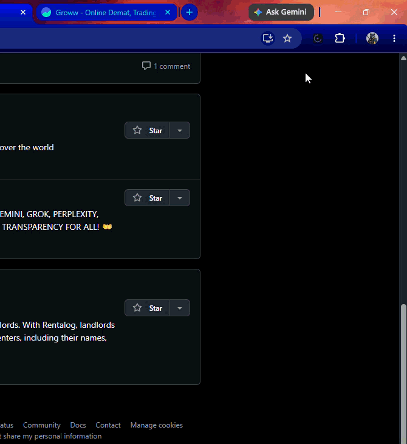
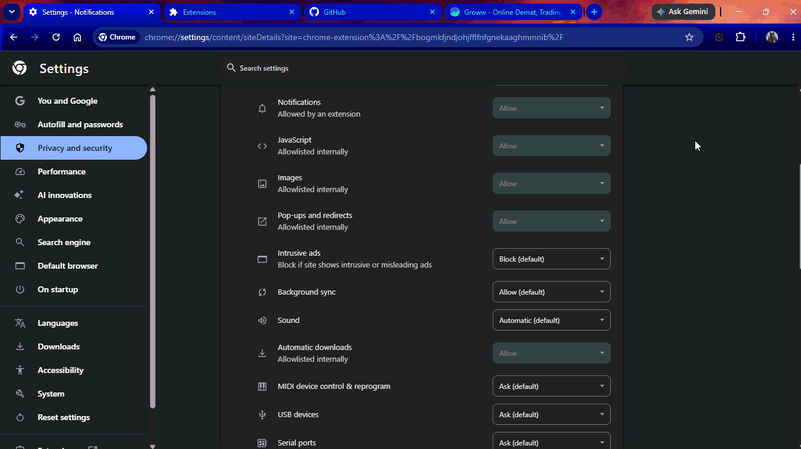

# Dhi.io — Focus Analytics for the Web

> **ध्यान** *(dhyaan)* — Sanskrit for *focus* and *attention*

Dhi is a Chrome extension that silently tracks where your attention goes online, scores your productivity in real time, and alerts you when context-switching is hurting your focus.

**No accounts. No cloud. Everything stays on your device.**

---

## Demo


| Real-time tracking | Productivity Index | Context switch alert |
|---|---|---|
|  |  |  |


---

## Features

- **Real-time tab tracking** — measures exact time spent on every domain
- **Productivity Index (PI)** — a 0–100 score weighted by site category
- **Category classification** — sites tagged as Productive / Neutral / Unproductive
- **Background audio detection** — YouTube/Spotify playing in background counts as 0.3× mild weight
- **Context switch alerts** — notifies you when you switch tabs 10+ times in 3 minutes
- **Idle detection** — pauses tracking when you walk away (60s threshold)
- **Daily auto-reset** — stats clear automatically at midnight
- **100% local** — all data lives in `chrome.storage.local`, nothing is sent anywhere

---

## Productivity Index Formula

```
PI = (Σ weighted_time / total_time) × 100 − passive_drag

Weights:
  Productive sites   → +1.0  (GitHub, StackOverflow, Notion, Figma...)
  Neutral sites      → +0.5  (Google, Gmail, Wikipedia...)
  Unproductive sites → −1.0  (YouTube, Twitter, Reddit, Netflix...)
  Background audio   → −0.2  (passive drag penalty)
```

| Score | Status |
|---|---|
| 75–100 | 🟢 Deep focus |
| 50–74 | 🟡 On track |
| 25–49 | 🟠 Scattered |
| 0–24 | 🔴 Distracted |

---

## Tech Stack

| Layer | Tech |
|---|---|
| Extension runtime | Chrome Manifest V3 |
| UI | React 18 + Vite |
| Charts | Pure SVG (zero dependencies) |
| Storage | `chrome.storage.local` |
| Background | Service Worker with keepalive alarms |

---

## Project Structure

```
FOCUS_EXTENSION/
├── public/
│   ├── background.js      # Service worker — all tracking logic
│   └── manifest.json      # Extension manifest
├── src/
│   ├── main.jsx           # React entry point
│   └── Popup.jsx          # Full popup UI (donut chart, PI ring, site list)
├── scripts/
│   └── copy-assets.cjs    # Copies background.js + manifest into dist/
├── index.html             # Popup HTML shell
└── vite.config.js         # Build config
```

---

## Setup & Development

### Prerequisites
- Node.js 18+
- Chrome browser

### Install
```bash
git clone https://github.com/HarshalKushwaha0027/Dhi.io
cd dhi.io-focus-extension
npm install
```

### Build
```bash
npm run build
```

This runs `vite build` and copies `background.js` + `manifest.json` into `dist/`.

### Load in Chrome
1. Open `chrome://extensions`
2. Enable **Developer mode** (top right)
3. Click **Load unpacked**
4. Select the `dist/` folder
5. Pin the extension from the toolbar puzzle icon

### Development workflow
```bash
# After any code change:
npm run build
# Then click ↺ refresh on chrome://extensions
```

---

## Roadmap

### Phase 1 — Local scoring ✅ (current)
- [x] Tab time tracking
- [x] Idle detection
- [x] Background audio (mild weight)
- [x] Domain normalization
- [x] Category classification
- [x] Productivity Index (PI) score
- [x] Context switch alert
- [x] Daily auto-reset

### Phase 2 — Deeper analytics (next)
- [ ] Weekly history chart (per-day breakdown)
- [ ] User-defined custom site categories
- [ ] Focus mode — block distracting sites for a set time
- [ ] Export data as CSV

### Phase 3 — Backend + ML (future)
- [ ] Node.js/Express sync API
- [ ] Python-based fatigue and pattern detection
- [ ] Personalised PI model trained on your own data
- [ ] dhi.io web dashboard

---

## Privacy

Dhi collects **zero** data externally. All browsing stats are stored locally in `chrome.storage.local` and never leave your device. The extension has no network requests, no analytics, no accounts.

---

## Contributing

Pull requests welcome. Please open an issue first for anything beyond bug fixes.

---

## License

MIT © 2026 — built with ध्यान